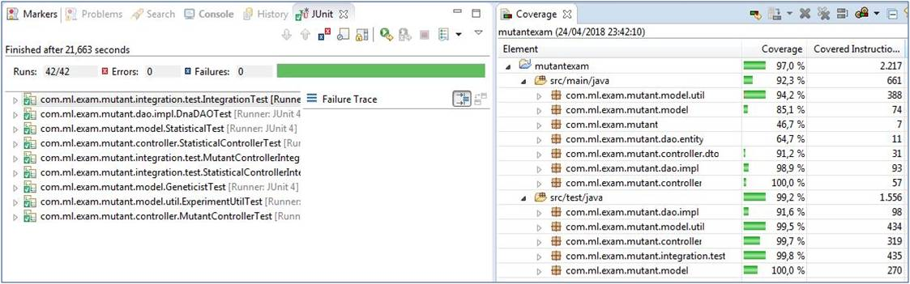

#  Proyecto deteccion de mutantes 

## Indice:
- [Especificaciones](#especificaciones)
- [Alcance](#alcance)
- [Digrama secuencial del proyecto](#digrama-secuencial-del-proyecto)
- [Implementacion y Tecnologias usadas](#implementacion-y-tecnologias-usadas)
- [Comentarios relevantes](#comentarios-relevantes)
- [Acceso a la API REST productivo](#acceso-a-la-api-rest-productivo)
- [Instrucciones para levantar la API REST de manera local](#instrucciones-para-levantar-la-api-rest-de-manera-local)
  - [Pre requisitos](#pre-requisitos)
  - [Configuracion](#configuracion)
  - [Ejecucion](#ejecucion)  
- [Test](#test)
  - [Cobertura](#cobertura)

## Especificaciones:
El proyecto consiste en una API REST que determina si un adn humano es un mutante basandose en mas de una determinada secuencia de genes.
Se puede encontrar el enunciado en el siguiente [link](https://github.com/jonaferreira/mutantexam/blob/master/doc/Challenge_MeLi_BE-Mutantes.pdf) 

## Alcance:
* El API REST contará con dos servicios web.
* Un servicio web será "/mutant/", que se encargará de determinar si un adn humano enviado como json es mutante o no.
En caso de verificar un mutante, debería devolver un HTTP 200-OK, en caso contrario un 403-Forbidden
* El otro servicio web será "/stats" que se encargará devolver un Json con las estadísticas de las verificaciones de ADN
Por ejemplo: {"count_mutant_dna":40, "count_human_dna":100, "ratio":0.4}
* Se guardara el request y un boolean si es mutante o no en un base de datos.
* Se creara test unitarios y de integracion.
* Se hosteara la aplicacion en un cloud computing

## Digrama secuencial del proyecto:
* Servicio Mutant


* Servicio Stats


## Implementacion y Tecnologias usadas:
* El proyecto está desarrollado en  [java 1.8.](http://www.oracle.com/technetwork/java/javase/downloads/jdk8-downloads-2133151.html) 
* Se utilizá Maven para la gestión de dependencias y actividades de instalación, build y packaging.
* Para ayudarme a construir la aplicación use la tecnología [Spring Boot](https://spring.io/) versión 1.5.6.RELEASE.
* La base de datos que uso es [PostgreSQL](https://www.postgresql.org/) version 9.
* Para los tests se uso [JUnit](http://junit.org/junit5/) y [Mockito](http://site.mockito.org/).
* Para hostear la aplicacion use cloud computing [Heroku] (https://www.heroku.com/).
* Para el parseo de los datos en formato Json uso [Gson](https://github.com/google/gson) 
* Como sistema de logs uso [Log4j](https://logging.apache.org/log4j/2.x/) 


## Comentarios relevantes
Cuando tome la decicion de usar como cloud computing Heroku, entendí que para hacer el deploy de la aplicacion debía usar maven, PostgreSQL y que sea una aplicacion stand alone.
Es por eso que investigue, y la tecnologia que mejor se ajustaba a los conocimientos que tengo y ayudaba hacer una aplicacion stand alone era SpringBoot. Ademas que me dio la oportunidad de aprender y a usar una nueva tecnologia, que combina conocientos que poseo sobre Spring, Hibernate, Log4j y Maven. La version de SpringBoot que use fue 2.1.8.RELEASE .

Al comenzar de desarrollar el ejercicio lo fui haciendo aplicando la tecnica TDD. En el cual hacia las pruebas y luego implementaba el codigo para que funcione las pruebas. En este punto use JUnit y use Mockito para simular respuestas.

Los conceptos basicos de este framework use la [documentacion oficial de SpringBoot](https://docs.spring.io/spring-boot/docs/current/reference/html/index.html) y 
[tutorial](https://spring.io/guides/gs/spring-boot/ ).


## Acceso a la API REST productivo:
- Modos de acceso a la API REST del cloud computing.
 * Para entrar al servicio “/mutant/” se debe enviar una secuencia ADN mediante un HTTP POST a esta URL:</br>
 
https://ml-mutanexam.herokuapp.com/mutant <br />

Request body. La secuencia ADN debe tener el siguiente formato JSON: <br />
POST → /mutant/ <br />
```
{ 
   "dna":["ATGCGA","CAGTGC","TTATGT","AGAAGG","CCCCTA","TCACTG"] 
}
```

Response:

```
  200 OK
```

 * Para entrar al servicio “/stats/” <br />
Request: <br />
GET  → /stats/ <br />

https://ml-mutanexam.herokuapp.com/stats <br />

Response: 200 (application/json)
```
  {"count_mutant_dna":4,"count_human_dna":1,"ratio":0.8}
```

	
## Instrucciones para levantar la API REST de manera local: 

### Pre requisitos:
* Se debe contar con motor de base de datos PostgreSQL version 9.2 o superior
* Tener mvn instalado en su ambiente, 3.6.1 o posterior.
* Tener un JDK versión 1.8.
* Y tener instalado el Git.

### Configuracion:
1. En un directorio clonar el proyecto 
```
git clone https://github.com/jonaferreira/mutantexam.git
```

2. Debe crearse una base de datos en PostgresQL con nombre "mutantexamDB" , con permisos de escritura y lectura, y el puerto 5432. 
Nota: Puede configurar el usuario y contraseña en el archivo application.properties ubicado en src/main/resources

3. Posicionarse en el directorio del proyecto y correr ```mvn clean install``` desde una terminal para descargar todas sus dependencias.

### Ejecucion:
- Posicionarse en el directorio del proyecto y ejecutar ```mvn spring-boot:run``` desde una terminal.

## Test:
Para la ejecucion de los test automaticos utilice JUnit y use framework Mockito para realizar pruebas .

- Para ejecutar las pruebas se puede ir al directorio del proyecto y correr el siguiente comando: ```mvn test```

### Cobertura
Ejecutando los test localmente con la herramienta Jacoco nos da 97%.



